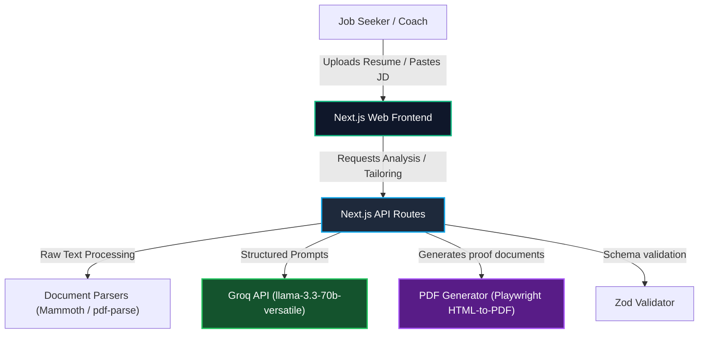

# System Architecture: Resume Shapeshifter

Resume Shapeshifter is a JD-to-resume tailoring engine. It is designed to evaluate a resume against a job description, identify experience gaps, truthfully rewrite experience bullets to align with the JD, and produce a high-fidelity side-by-side comparison PDF proof.

---

## 1. Architectural Goals

*   **Truthfulness First**: Absolute guardrails against fabrication. The system must not invent employers, dates, certifications, degrees, skills, or metrics. Any suggestions or rewrites must be traceable to the user's actual original experience.
*   **Explainability**: All match scores, rewrites, and detected gaps must provide clear, human-readable rationale and evidence, rather than opaque numbers or magic modifications.
*   **Structured I/O**: Strict validation at all service boundaries using **Zod schemas** and TypeScript types.
*   **Decoupled & Modular (RULE[user_global])**: Clear separation of concern. Services are isolated, rendering components are purely presentational, and global styles use Vanilla CSS variables (`:root`) with CSS Modules per component.
*   **Performance & Efficiency**: Smart token budgeting (truncating broad JDs to key requirements sections, chunked bullet rewrites per role/employer) to optimize cost and latency.

---

## 2. System Context Diagram



---

## 3. High-Level Decomposition

The system is designed as a Next.js full-stack application.

```
┌────────────────────────────────────────────────────────┐
│                      Web Browser                       │
│  ┌──────────────────────────────────────────────────┐  │
│  │                     Pages                        │  │
│  │   / (Landing)   /tailor (Input & Workspace)      │  │
│  └───────────┬──────────────────────────┬───────────┘  │
│              ▼                          ▼              │
│  ┌──────────────────────────────────────────────────┐  │
│  │                  Components                      │  │
│  │   ResumeInput     JDInput       ScoreCard        │  │
│  │   GapAnalysis    SideBySideDiff  PDFExport       │  │
│  │   (Styled exclusively with Vanilla CSS Modules)  │  │
│  └───────────────────┬──────────────────────────────┘  │
└──────────────────────┼─────────────────────────────────┘
                       │ HTTP Requests (JSON)
                       ▼
┌────────────────────────────────────────────────────────┐
│                   Next.js Server                       │
│  ┌──────────────────────────────────────────────────┐  │
│  │                   API Routes                     │  │
│  │  /api/parse/resume        /api/parse/jd          │  │
│  │  /api/analyze             /api/tailor            │  │
│  │  /api/export/pdf                                 │  │
│  └───────────┬──────────────────────────────────────┘  │
│              ▼                                         │
│  ┌──────────────────────────────────────────────────┐  │
│  │              Service Orchestrator                │  │
│  └───────────┬──────────────────────────┬───────────┘  │
│              ▼                          ▼              │
│  ┌───────────────────────┐      ┌───────────────────┐  │
│  │    Domain Services    │      │ Utility Services  │  │
│  │  ├─ Resume Parser     │      │  ├─ Zod Schema    │  │
│  │  ├─ JD Parser         │      │  │   Validator    │  │
│  │  ├─ Match Engine      │      │  ├─ Guardrail       │  │
│  │  ├─ Tailoring Engine  │      │  │   Checker      │  │
│  │  ├─ Gap Engine        │      │  └────────────────┘  │
│  │  └─ PDF Generator     │                             │
│  └───────────┬───────────┘                             │
└──────────────┼─────────────────────────────────────────┘
               ▼
   ┌───────────────────────┐
   │ External Integrations │
   │ ├─ Groq API Client    │
   │ └─ PDF Engine         │
   └───────────────────────┘
```

---

## 4. Core Domain Models & Schemas

Defined in `lib/schemas.ts`, these types represent the contract between the frontend, Next.js server, and external LLM responses.

### 4.1 ResumeProfile
Stores structured information extracted from the user's raw resume.
```typescript
export interface ContactInfo {
  name: string;
  email: string;
  phone?: string;
  location?: string;
  website?: string;
}

export interface ExperienceEntry {
  company: string;
  title: string;
  startDate?: string;
  endDate?: string;
  bullets: string[];
}

export interface ProjectEntry {
  name: string;
  description: string;
  bullets: string[];
  technologies?: string[];
}

export interface EducationEntry {
  institution: string;
  degree: string;
  fieldOfStudy?: string;
  graduationDate?: string;
}

export interface CertificationEntry {
  name: string;
  issuer: string;
  date?: string;
}

export interface ResumeProfile {
  contact: ContactInfo;
  summary: string;
  skills: string[];
  experience: ExperienceEntry[];
  projects: ProjectEntry[];
  education: EducationEntry[];
  certifications: CertificationEntry[];
}
```

### 4.2 JobDescriptionProfile
Structured keywords and parameters extracted from job postings.
```typescript
export interface JobDescriptionProfile {
  jobTitle: string;
  company?: string;
  requiredSkills: string[];
  preferredSkills: string[];
  responsibilities: string[];
  qualifications: string[];
  tools: string[];
  keywords: string[];
  seniorityLevel: string;
  domainSignals: string[];
}
```

### 4.3 MatchScore
Details of the explainable match assessment.
```typescript
export interface MatchScore {
  overallScore: number;
  skillCoverageScore: number;
  responsibilityAlignmentScore: number;
  keywordScore: number;
  seniorityScore: number;
  criticalMissingRequirements: string[];
  explanation: string;
}
```

### 4.4 TailoredResume
Structured rewritten elements resulting from LLM-assisted adjustment.
```typescript
export interface TailoredBullet {
  original: string;
  tailored: string;
  changeReason: string;
  keywordsAddressed: string[];
  confidence: "high" | "medium" | "low";
  riskFlag?: string;
}

export interface TailoredExperienceEntry {
  company: string;
  title: string;
  bullets: TailoredBullet[];
}

export interface TailoredResume {
  tailoredSummary: string;
  tailoredSkills: string[];
  tailoredExperience: TailoredExperienceEntry[];
}
```

### 4.5 GapAnalysis
Categorized checklist of missing or weakly-represented items.
```typescript
export interface ResumeGap {
  name: string;
  importance: "high" | "medium" | "low";
  jdEvidence: string;
  resumeEvidence: string;
  suggestedAction: string;
  canSafelyAdd: boolean;
}

export interface GapAnalysis {
  gaps: ResumeGap[];
}
```

### 4.6 TailoringRun
Unified state model representing a single session tailored result.
```typescript
export interface TailoringRun {
  id: string;
  createdAt: string;
  resume: ResumeProfile;
  jobDescription: JobDescriptionProfile;
  originalMatch: MatchScore;
  tailoredResume?: TailoredResume;
  tailoredMatch?: MatchScore;
  gapAnalysis: GapAnalysis;
  status: "draft" | "analyzed" | "tailored" | "exported";
}
```

---

## 5. Domain Services Architecture

### 5.1 Resume Parser
*   **Inputs**: Raw uploaded PDF/DOCX buffer or pasted plain text.
*   **Operation**: Undergoes text extraction (mammoth/pdf-parse), followed by regex-based fallback section splitting, and passes the raw segments to the LLM using the `resume-parser.ts` prompt for highly structured parsing.
*   **Outputs**: Strict validated `ResumeProfile` JSON.

### 5.2 JD Parser
*   **Inputs**: Raw text pasted by the user.
*   **Operation**: Sends text to the LLM with `jd-extraction.ts` prompt to extract keywords, skills, and titles.
*   **Outputs**: Strict `JobDescriptionProfile` JSON.

### 5.3 Match Engine
*   **Inputs**: `ResumeProfile` (original or tailored) + `JobDescriptionProfile`.
*   **Operation**: Evaluates the alignment. Combines deterministic scoring (keyword/skill coverage set intersection) with LLM semantic evaluation for responsibilities and seniority.
*   **Outputs**: Explainable `MatchScore` object with category scores and written explanation.

### 5.4 Tailoring Engine
*   **Inputs**: `ResumeProfile` + `JobDescriptionProfile` + `GapAnalysis`.
*   **Operation**: Evaluates sections contextually. Employs `bullet-rewriter.ts` prompt to adapt resume bullets. Processes in batches (grouped by employer) to fit token limits.
*   **Outputs**: `TailoredResume` JSON.

### 5.5 Gap Engine
*   **Inputs**: `ResumeProfile` + `JobDescriptionProfile`.
*   **Operation**: Compares requirements in the JD with the evidence found in the resume. Categorizes gaps based on whether the skill is completely missing or just weakly emphasized.
*   **Outputs**: `GapAnalysis` with actionable recommendations.

### 5.6 Guardrail Checker
*   **Inputs**: Original `ResumeProfile` + generated `TailoredResume`.
*   **Operation**: Validates against experience inflation.
    *   *Deterministic checks*: Verify no new employers, job titles, education, or dates are introduced. Verify that numerical metrics are either identical or simplified (never inflated).
    *   *LLM-assisted checks*: Assess whether rewrites introduce unsubstantiated claims. Downgrade bullet confidence to `medium` or `low` and attach `riskFlag` warning if keywords represent skills not implied by original source bullet text.
*   **Outputs**: List of warnings, auto-reverted bullet fields, or UI warning banners.

### 5.7 PDF Generator
*   **Inputs**: `TailoringRun` data.
*   **Operation**: Compiles an elegant HTML template representing the two side-by-side columns. Highlights rewritten bullets using visual background colors. Generates the PDF using Playwright on the server, or prints through standard styling controls.
*   **Outputs**: Downloadable PDF binary stream.

---

## 6. LLM Orchestration & Prompt Rules (Groq Cloud API)

The system delegates all natural language processing to the **Groq API Cloud** to achieve extreme throughput, low latency, and structure accuracy.

### 6.1 Groq Configuration
*   **Primary LLM Model**: `llama-3.3-70b-versatile` (user-selected: rich 128k context window, high reasoning compatibility).
*   **Fallback Model**: `mixtral-8x7b-32768`.
*   **SDK Platform**: `@groq/groq-sdk` or standard OpenAI-compatible endpoints with custom base URLs.
*   **Response Formatting**: JSON Mode schema enforcement where possible.

### 6.2 Temperature Settings
*   **Extraction & Scoring (0.0 to 0.1)**: Requires maximum precision, structural adherence, and factuality.
*   **Bullet Rewriting (0.3 to 0.4)**: Allows slight linguistic flexibility to integrate terminology naturally, while heavily constrained by truthfulness guardrails.

### 6.3 Prompt Modules List
1.  `prompts/resume-parser.ts`: Instructs Llama to structure dirty, unstructured resume text.
2.  `prompts/jd-extraction.ts`: Focuses on extracting structured job description requirements.
3.  `prompts/match-scoring.ts`: Generates logical, structured breakdowns of JD compatibility.
4.  `prompts/gap-analysis.ts`: Compares resume against JD and returns gaps with evidence.
5.  `prompts/bullet-rewriter.ts`: Instructs the model to refine resume bullets without hallucinating metrics or experience.

---

## 7. Security & Configurations

*   **API Credentials**: Server-side env storage only (`GROQ_API_KEY`).
*   **Payload Sanity**: File uploads limited to 5MB. Pasted text truncated to prevent prompt injection or high token charges.
*   **Privacy Guard**: Resume content stored ephemerally in `sessionStorage` or local memory, preventing persistence of PII (Personally Identifiable Information) unless explicitly configured.
